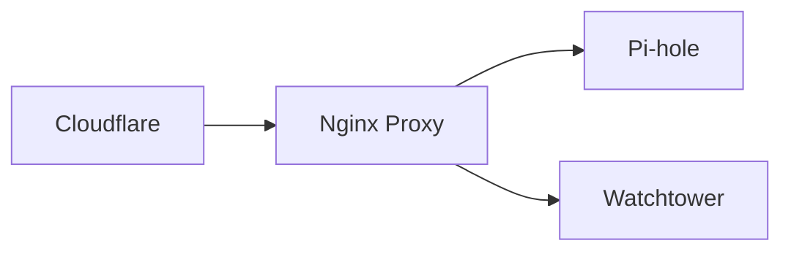

# Welcome to LinuxPi.ca

This site is my personal knowledge base for managing Linux-based Raspberry Pi projects. Here, I document configurations, troubleshooting steps, and command-line hacks that I've found useful for my home setup.

---

## Quick Navigation

Need to jump to a specific task? Use these links:

- [**File Permissions**](linux-basics/file-permissions.md) - Learn how to change ownership and access.
- [**Headless Boot Setup**](advanced/headless.md) - How to set up a Pi without a monitor.
- [**User Management**](linux-basics/User%20Managment.md) - Adding/removing users and sudoers.
- [**Samba Configuration**](linux-basics/Smba%20config.md) - Set up network file sharing.
- [**List of Shell Commands**](linux-basics/List%20of%20Shell%20Commands.md) - A handy cheat sheet of common terminal commands.
- [**List Drives**](linux-basics/List%20Drives.md) - Commands to find and list connected storage drives.
- [**Generate & Install SSH Keys**](linux-basics/Generate%20and%20install%20SSH%20keys.md) - Set up passwordless SSH access.
- [**Crontab**](linux-basics/Crontab.md) - Automate tasks and schedule scripts.
- [**Common Terminal Shortcuts**](linux-basics/Common%20terminal%20shorcuts.md) - Keyboard shortcuts to navigate the terminal faster.
- [**Keep Processes Running**](linux-basics/Close%20terminal%20and%20keep%20process%20running.md) - How to close the terminal without stopping active tasks.
- [**Clean up Linux System**](linux-basics/Clean%20up%20Linux%20system.md) - Free up disk space and remove unused packages.
- [**Change DNS Server**](linux-basics/Change%20DNS%20Server%20on%20Linux.md) - Configure custom DNS servers on your Pi.

---

-   **File Permissions🗂️** 

    ---

    Learn how to change ownership and access.

    [View Guide](linux-basics/file-permissions.md)

-   **Headless Boot:simple-mcdonalds:{ .mcdonalds }🤯**

    ---

    How to set up a Pi without a monitor.

    [View Guide](advanced/headless.md)

---

