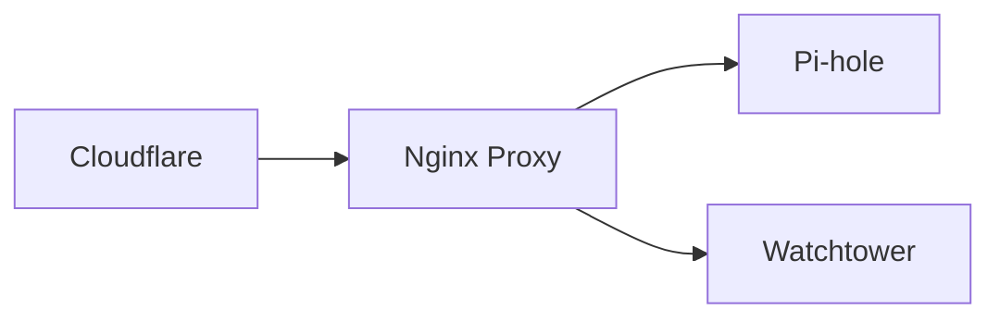

# Welcome to LinuxPi.ca

This site is my personal knowledge base for managing Linux-based Raspberry Pi projects. Here, I document configurations, troubleshooting steps, and command-line hacks that I've found useful for my home setup.

---

## Quick Navigation

Need to jump to a specific task? Use these links:

* [**File Permissions**](linux-basics/file-permissions.md) - Learn how to change ownership and access.
* [**Headless Boot Setup**](advanced/headless.md) - How to set up a Pi without a monitor.
* [**User Management**](linux-basics/User%20Managment.md) - Adding/removing users and sudoers.

---

-   **File Permissions🗂️** 

    ---

    Learn how to change ownership and access.

    [View Guide](linux-basics/file-permissions.md)

-   **Headless Boot:simple-mcdonalds:🤯**

    ---

    How to set up a Pi without a monitor.

    [View Guide](advanced/headless.md)

